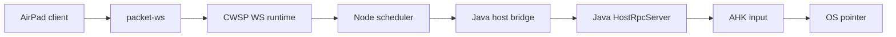

# CWSP AirPad Latency Recovery Plan

## Root Cause Hypotheses
Current evidence points to stacked smoothing/coalescing rather than one single queue:
- AirPad client can feed multiple sensors into one accumulator.
- Node scheduler/coalescer and Java bridge collapse deltas before execution.
- `SMOVE` defaults to AHK micro-steps with sleeps, which can block the AHK read loop and create inertia.
- Java bridge currently drops collapsed deltas on input socket write failure.
- Deploy/materialization drift can reintroduce stale Java/AirPad code unless guarded.

## Target Hot Path

Goal: every layer either applies immediately or collapses only the newest live delta, never queues stale relative movement.

## Phase 1: Evidence And Safety Gates
- Keep and extend [`runtime/cwsp/scripts/verify-deploy-source-integrity.mjs`](runtime/cwsp/scripts/verify-deploy-source-integrity.mjs) so deploy cannot ship stale AirPad/SMOVE/Java layouts.
- Add runtime diagnostics for one short AirPad drag:
  - source sensor count and client send Hz.
  - Node coalesced count and queue depth.
  - Java bridge write latency and failure count.
  - Java HostRpc/AHK command timing.
- Add a debug mode env preset with low-volume logs:
  - `CWS_INPUT_APPLY_LOG=1`
  - `CWS_INPUT_APPLY_LOG_SAMPLE_MS=50`
  - a short flood/route log window only.

## Phase 2: Client-Side AirPad Fixes
- In [`modules/views/airpad-view/src/ui/air-button.ts`](modules/views/airpad-view/src/ui/air-button.ts), ensure only one primary motion source is active:
  - prefer `RelativeOrientationSensor` when available.
  - use gyro/accelerometer only as fallback.
- Keep AirPad send cadence at 60/30Hz, but reduce client inertia:
  - audit `REL_ORIENT_SMOOTH`, zero-decay, and max-step behavior in [`relative-orientation.ts`](modules/views/airpad-view/src/input/sensor/relative-orientation.ts).
  - avoid long decay tails after stop.
- Add tests proving only one sensor path enqueues motion during `AIR_MOVE`.

## Phase 3: Node Hot Path Fixes
- In [`runtime/cwsp/endpoint/server/inputs/shared/mouse/input-delta-coalescer.ts`](runtime/cwsp/endpoint/server/inputs/shared/mouse/input-delta-coalescer.ts), make `.110` latency mode explicit:
  - `through` means no governor delay and no stabilizer tail.
  - coalesce only currently pending live delta, not stale backlog.
- In [`java-host-bridge.ts`](runtime/cwsp/endpoint/server/inputs/shared/drivers/java-host-bridge.ts):
  - preserve collapsed delta on transient input socket write failure, but drop it if it becomes stale.
  - wire existing config naming (`CWS_JAVA_HOST_INPUT_QUEUE`) to live queue max or remove/document the unused variable.
  - record write failure/drop counters.
- Add tests for bridge write failure distance preservation and stale-drop behavior.

## Phase 4: Java/AHK Latency-First Execution
- Change default remote execution to instant `MOVE` for live AirPad motion.
- Keep `SMOVE` as opt-in or adaptive only:
  - disabled by default for AirPad live control.
  - if enabled, use `frameMs=0..1` and small step count.
- In Java:
  - ensure `HostRpcServer` handles `MOVE`/`SMOVE` fire-and-forget without executor backlog.
  - route click/toggle ordering consistently with movement to prevent edge mis-order.
- In AHK:
  - keep `MouseMove(dx, dy, 0, "R")` as the default path.
  - make `SmoothMoveRelative` interruptible or non-blocking if it remains enabled.

## Phase 5: Deploy-Safe Validation
- Local checks:
  - endpoint AirPad/Java regression tests.
  - `npm run java:build`.
  - `npm run check:types` and `npm run build` in `runtime/cwsp/endpoint`.
  - `npm run test:regression` in `modules/views/airpad-view`.
  - `npm run check:types`, `test:packet-builders`, and `build:apk:fast` in `apps/CWSAndroid`.
- Non-disruptive remote checks:
  - `.110` PM2 status and ports `8434`/`19721`.
  - stage candidate JAR only.
  - verify candidate JAR contains current AHK + Java classes.
- Only after local and staged checks pass:
  - replace active `.110` JAR and restart `cwsp-java-host` only.
  - then deploy/restart Node if needed.

## Phase 6: Live A/B Matrix
- Test on `.110` direct LAN:
  - instant MOVE default.
  - SMOVE off.
  - optional SMOVE low-step/low-frameMs.
- Test routed via `.200`:
  - compare `through` vs `adaptive` apply mode.
  - confirm no stale catch-up after stop/click.
- Keep the best measured profile as default; leave slower smoothing behind explicit env flags only.

## Success Criteria
- No visible delayed catch-up after stopping phone movement.
- No large jumps after reconnect or route hiccup.
- Click/down/up does not apply behind stale movement.
- Deploy/restart cannot revert Java/AirPad hot-path contracts silently.
- `.110` and `.200` runtime profiles are explicit and reproducible.
