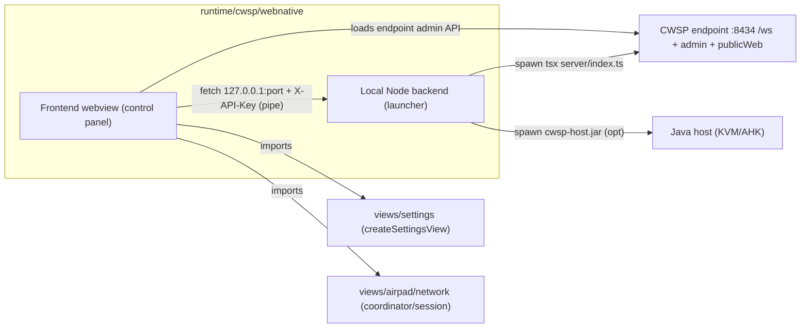

# WebNative CWSP Desktop Control Panel

## Goal
A desktop CWSP control app built with `@mindw1n/webnative` (native WebView + local Node backend). It is a **new minimal control panel** that reuses the existing Frontend `settings` and `network` components (NOT the airpad trackpad view), exposes service controls (start / pause / update / configure), still drives the Java host (`cwsp-host.jar`), and boots **hidden/minimized as a service** by default. Capacitor/PWA/CRX builds are untouched — the new app only *imports* existing view modules behind a new additive build target.

Lives at: `runtime/cwsp/webnative/` (sibling of `runtime/cwsp/electron.js` and `runtime/cwsp/endpoint/`).

## Architecture



WebNative's model matches the existing `runtime/cwsp/electron.js` pattern: a thin local backend spawns the real CWSP runtime as a child process; the webview talks to a local control RPC + the endpoint's own admin/`/ws` surface.

## Key reuse points (no duplication)
- Settings UI: `createSettingsView` from [apps/CrossWord/src/frontend/views/settings/ts/Settings.ts](apps/CrossWord/src/frontend/views/settings/ts/Settings.ts) (registered via `registerBuiltinSettingsContributions` + `registerCwspSettingsContribution` in [apps/CrossWord/src/frontend/views/settings/ts/settings-contributions.ts](apps/CrossWord/src/frontend/views/settings/ts/settings-contributions.ts)). Server/identity section already exists at [apps/CrossWord/src/frontend/views/settings/sections/SettingsServer.ts](apps/CrossWord/src/frontend/views/settings/sections/SettingsServer.ts).
- Network layer reuse: coordinator/session from [apps/CrossWord/src/frontend/views/airpad/network/](apps/CrossWord/src/frontend/views/airpad/network/) (`coordinator.ts`, `session.ts`, `transport/websocket.ts`) wrapped in a lightweight read-only status panel — no airpad input/gyro code imported.
- Endpoint admin API already provides health/settings/users/MCP routes served from [runtime/cwsp/endpoint/server/admin/index.ts](runtime/cwsp/endpoint/server/admin/index.ts) — the control panel calls these (and `/ws` for live status) instead of inventing new control transport.
- Build aliases (`fest/*`, `views/*`, `com/*`, `cwsp-shared/*`, `shells/*`) come from the shared config at `apps/CrossWord/shared/vite.config.js` + `apps/CrossWord/tsconfig.json` — reused, not redefined.

## Files to create

### `runtime/cwsp/webnative/webnative.json`
App manifest. `window.visible=false` by default (service mode); `window.width/height` for when shown.
```json
{
  "id": "space.u2re.cwsp.desktop",
  "name": "CWSP",
  "icon": "app/icon.png",
  "categories": ["Utility"],
  "window": { "width": 1100, "height": 720, "visible": false }
}
```

### `runtime/cwsp/webnative/app/backend/index.ts`
Thin launcher backend (WebNative local express + pipe, per template `backend/index.ts`):
- Spawns CWSP endpoint: `tsx runtime/cwsp/endpoint/server/index.ts` with env (`CWS_PORTABLE_CONFIG_PATH`, `CWS_PORTABLE_DATA_PATH`, `CWS_MODULE_*`, `CWS_CLIPBOARD_ENABLED`, ...) — mirrors [runtime/cwsp/electron.js](runtime/cwsp/electron.js) spawn block.
- Optional Java host spawn (`cwsp-host.jar`) gated by config/env (`CWS_WEBNATIVE_JAVA_HOST=1`), reusing `runtime/cwsp/scripts/run-java-host.mjs` logic.
- Control RPC routes (auth via pipe-passed `X-API-Key`):
  - `POST /service/start` · `POST /service/pause` (stop child, keep config) · `POST /service/restart` · `POST /service/update` (re-pull/build per `runtime/cwsp/scripts/build-portable.mjs` staging) · `GET /service/status` · `GET /service/config` · `POST /service/config` (write `portable.config.json` / settings, then restart child) · `POST /window/show` · `POST /window/hide`.
- Writes the `{port,key}` to the WebNative pipe so the webview can authenticate.
- On boot: auto-start endpoint, keep window hidden unless `CWS_WEBNATIVE_SHOW_UI=1` or user invokes show.

### `runtime/cwsp/webnative/app/frontend/` (control panel UI)
Minimal shell with three tabs: **Service**, **Settings**, **Network**.
- `index.html` + `index.ts` entry.
- `tabs/service.ts` — Start/Pause/Restart/Update/Configure buttons + live status (polls `GET /service/status` + endpoint `/health`).
- `tabs/settings.ts` — mounts `createSettingsView({ isExtension:false })` and calls `registerBuiltinSettingsContributions()`/`registerCwspSettingsContribution()` so the same Server/Appearance/AI/MCP sections render. Persist via endpoint admin `Save settings`.
- `tabs/network.ts` — status panel built from `views/airpad/network/coordinator` + `session` (read-only peer/route/transport view; reuses `getRemoteHost`, `getRemoteRouteTarget`, `getAirPadEndpointUrl` from [apps/CrossWord/src/frontend/views/airpad/config/config.ts](apps/CrossWord/src/frontend/views/airpad/config/config.ts)). No airpad input/gyro imports.
- `api.ts` — WebNative `authenticate()` + `fetch(127.0.0.1:port)` helper (per template `api/linux.ts`).

### `runtime/cwsp/webnative/app/frontend/vite.config.ts`
New Vite build target (additive, does not touch `apps/CrossWord/vite.config.js`). Reuses `apps/CrossWord/shared/vite.config.js` aliases + tsconfig paths so `fest/*`, `views/*`, `com/*`, `cwsp-shared/*` resolve. Outputs to `runtime/cwsp/webnative/app/public/` which WebNative serves to the webview.

### `runtime/cwsp/scripts/build-webnative.mjs`
Build orchestrator (mirrors `build-electron.mjs`):
1. `stageCwspServerRuntime()` into `dist/webnative/cwsp-runtime/` (reuse `stage-cwsp-server-runtime.mjs`).
2. Vite-build the control panel frontend → `app/public/`.
3. Copy backend + `webnative.json` + icon into `dist/webnative/`.
4. Invoke `npx webnative build linux` (and `windows` via flag).
5. Emit `dist/webnative/CWSP` self-contained + a `start` launcher that boots hidden.

### `runtime/cwsp/scripts/dev-webnative.mjs`
Dev: run backend with `tsx`, Vite-serve frontend on a port, point webview at it. `CWS_SKIP_JAVA_HOST=1` supported (same as `dev:node`).

### `runtime/cwsp/package.json` (scripts block, additive)
```jsonc
"build:webnative": "node scripts/build-webnative.mjs",
"build:webnative:linux": "node scripts/build-webnative.mjs --linux",
"build:webnative:windows": "node scripts/build-webnative.mjs --windows",
"dev:webnative": "node scripts/dev-webnative.mjs",
"dev:webnative:node": "CWS_SKIP_JAVA_HOST=1 node scripts/dev-webnative.mjs"
```

## Service / hidden-by-default behavior
- `webnative.json` `window.visible=false` → webview boots minimized/hidden.
- Backend auto-starts the endpoint child on launch regardless of window visibility.
- Show UI via: tray/menu IPC (`POST /window/show`), or env `CWS_WEBNATIVE_SHOW_UI=1` for debugging.
- Pause = stop endpoint child (config retained); Start = respawn; Update = re-stage + restart; Configure = write config + restart.
- Matches the "auto-launch as service" requirement without removing interactive UI when the user opens it.

## Compatibility preservation (Capacitor / PWA / CRX / Electron)
- No edits to `apps/CrossWord/src/frontend/views/**`, `apps/CrossWord/src/pwa/**`, `apps/CrossWord/src/crx/**`, or `apps/CrossWord/vite.config.js`.
- No edits to `runtime/cwsp/electron.js` / `build-electron.mjs` — WebNative is an additive second desktop shell.
- Only *imports* existing view modules; alias resolution is reused from the shared Vite config.
- Endpoint server code unchanged — the backend spawns it as-is.

## Validation
- `npm run build:webnative:linux` produces a self-contained app in `dist/webnative/`.
- `npm run dev:webnative:node` boots endpoint hidden, control panel reachable after `CWS_WEBNATIVE_SHOW_UI=1`.
- Settings tab persists via endpoint admin API; Network tab shows live peer/route; Service buttons start/pause/restart the endpoint child and (optional) Java host.
- No regressions: `npm run build` (endpoint) and `npm run build:crx` still pass.

## Risks / open items
- WebNative Windows/Linux WebView runtime availability on desk `.110` (Windows) — will rely on system WebView2; verify on deploy.
- `webnative.json` `window.visible` key name needs confirmation against WebNative prebuilds (will verify in `node_modules/@mindw1n/webnative/prebuilds/dist` during implementation; fallback to backend-driven hide).
- Java host interaction: backend will shell out to `cwsp-host.jar`; KVM cursor-unfreeze (`scripts/kvm-cursor-unfreeze.mjs`) stays wired through the endpoint, not duplicated.
