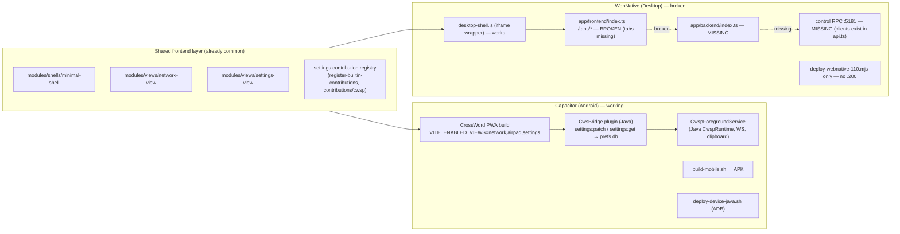
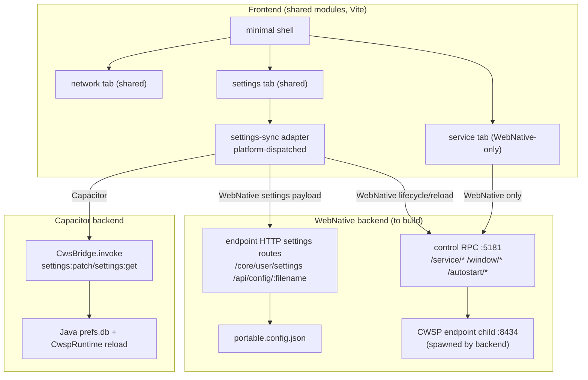

# Capacitor ↔ WebNative CWSP Parity Plan

## Current state (audit)

### Parity matrix

| Dimension | Capacitor | WebNative | Gap |
|---|---|---|---|
| Views | network, airpad, settings | network, settings (no airpad — intentional) | none (per decision) |
| Platform-specific tab | airpad (controller) | service (lifecycle/window) — **missing** | add service tab |
| Settings frontend | shared `settings-view` + `CwsBridge` adapter | shared `settings-view` + `api.ts` adapter — **broken backend** | fix backend |
| Settings backend | Java `prefs.db` via `CwsBridge` | endpoint HTTP `/core/user/settings` + `/api/config/:filename` — **not wired** | wire adapter |
| Service lifecycle | implicit (Java FG service) | control RPC `:5181` — **missing** | implement |
| Build | `build-mobile.sh` → APK | `build-webnative.mjs` → exe/AppImage — **fails on missing backend** | fix |
| Deploy | ADB `.196/.208/.210` | SCP `.110` only | add `.200` |

## Target architecture

## Implementation tasks

### 1. Restore WebNative backend (`app/backend/index.ts`)
**Create** `runtime/cwsp/webnative/app/backend/index.ts` (real file, not symlink — `app/backend` currently symlinks to `runtime/cwsp/src` which is the CWSP server, wrong target).

- Spawn CWSP endpoint child: `runtime/cwsp/endpoint/server/index.ts` as a child process; track pid/startedAt/lastError.
- Start control RPC server on `CWS_WEBNATIVE_CONTROL_PORT` (default 5181) with `X-API-Key` header guard (key from env/`__webnative_auth__.json`).
- Routes (server-side, matching `app/frontend/api.ts` clients):
  - `GET /service/status` → `{ endpoint, javaHost, pid, startedAt, lastError, updateInProgress, windowVisible }`
  - `POST /service/start` / `/service/pause` / `/service/restart` / `/service/update`
  - `GET /service/config` → proxy to endpoint `GET /api/config/portable.config.json`
  - `POST /service/config` → proxy to endpoint `POST /api/config/portable.config.json` + emit reload signal to endpoint child
  - `POST /window/show` / `/window/hide` (no-op IPC stubs the native runtime hooks)
  - `POST /autostart/install` / `/autostart/uninstall` (delegate to `webnative-autostart.mjs`)
- Write auth `{ port, key }` to the WebNative pipe / `app/public/__webnative_auth__.json` (dev).

**Reference contracts:**
- Client shape: `app/frontend/api.ts` (`Auth`, `control()`, `getStatus`, `saveConfig`)
- Endpoint settings routes: `runtime/cwsp/endpoint/server/fastify/handlers/settings.ts` (`GET/POST /core/user/settings`, `GET /api/config/:filename`, `GET/POST /core/admin/prefs`)
- Manifest: `runtime/cwsp/webnative/webnative.json` (`window.visible=false`, service model per `README.md`)

### 2. Fix WebNative frontend entry (`app/frontend/index.ts`)
**Rewrite** `runtime/cwsp/webnative/app/frontend/index.ts` — replace broken `./tabs/*` imports with the shared view modules (mirror Capacitor's approach via symlinks already present: `minimal`, `network`, `settings`):

- Create `app/frontend/tabs/service.ts` — WebNative-only service panel (Start/Pause/Restart/Show/Hide/Update buttons bound to `api.ts` control calls). This is the desk equivalent of Capacitor's `CwsPlatformPlugin` surface.
- `tabs/settings.ts` → re-export `renderSettingsPanel` from the symlinked `../settings` (shared `settings-view`).
- `tabs/network.ts` → re-export `renderNetworkPanel` from the symlinked `../network` (shared `network-view`).
- Ensure `app/frontend/network` and `app/frontend/settings` are live symlinks to `modules/views/{network,settings}-view/src` (not vendored copies — currently vendored; switch to symlinks for parity with Capacitor's `app/src/capacitor/{network,settings}`).

### 3. Unify settings-sync adapter (hybrid contract)
**Create** a shared settings-sync dispatcher in the shared settings-view layer (or a thin adapter module imported by settings-view) that branches on platform:

- `settings:get`:
  - Capacitor → `CwsBridge.invoke({ channel: "settings:get" })` (existing, unchanged)
  - WebNative → `fetch(endpointOrigin + "/core/user/settings?userId=...&userKey=...")` + fallback `GET /api/config/portable.config.json`
- `settings:patch`:
  - Capacitor → `CwsBridge.invoke({ channel: "settings:patch", payload: { appSettings, airpadJson, shellPatch } })` (existing)
  - WebNative → `POST /core/user/settings` (payload) + `POST /service/config` via control RPC (triggers endpoint reload)
- Platform detection: existing `settings-shell-profile.ts` already keys off `capacitor`/`native`/`crx` surfaces — reuse the same surface flag.
- Keep Capacitor's `CwsBridge` contract and Java `prefs.db` path **unchanged** (no regression). The unification is on the *frontend adapter*, not the backend storage.

**Files:**
- New adapter: `modules/views/settings-view/src/ts/settings-sync-adapter.ts` (or extend existing `settings-contributions.ts`)
- WebNative wire-in: `runtime/cwsp/webnative/app/frontend/api.ts` already has `getConfig`/`saveConfig` — keep as the WebNative arm of the adapter
- Capacitor arm: existing `cws-bridge.ts` `patchNativeUnifiedSettingsDetailed`

### 4. Add `deploy:200:webnative`
**Create** `runtime/cwsp/scripts/deploy-webnative-200.mjs` — clone of `deploy-webnative-110.mjs` retargeted to host `.200` (gateway/proxy node), SCP path adapted.

**Wire** npm scripts in `runtime/cwsp/package.json`:
- `deploy:200:webnative` → `node scripts/deploy-webnative-200.mjs`
- `postdeploy:200:webnative` → `... --skip-build --warn-only` (mirror `.110` pattern)

### 5. Build verification
- `npm run build:webnative` (in `runtime/cwsp/webnative`) must succeed end-to-end: Vite custom panel + esbuild backend + Windows portable staging.
- `npm run dev:webnative` must boot: backend `:5181` + endpoint child `:8434` + Vite `:5180`.
- `npm run build:capacitor` (in `apps/CWSAndroid`) unchanged — verify no regression from shared settings-view adapter change.

## Files to change

| File | Action |
|---|---|
| `runtime/cwsp/webnative/app/backend/index.ts` | **create** (control RPC + endpoint child spawner) |
| `runtime/cwsp/webnative/app/frontend/index.ts` | **rewrite** (drop broken `./tabs/*`, wire shared modules) |
| `runtime/cwsp/webnative/app/frontend/tabs/service.ts` | **create** (WebNative service panel) |
| `runtime/cwsp/webnative/app/frontend/tabs/settings.ts` | **create** (re-export from shared settings-view) |
| `runtime/cwsp/webnative/app/frontend/tabs/network.ts` | **create** (re-export from shared network-view) |
| `runtime/cwsp/webnative/app/frontend/network` | **change** vendored copy → symlink to `modules/views/network-view/src` |
| `runtime/cwsp/webnative/app/frontend/settings` | **change** vendored copy → symlink to `modules/views/settings-view/src` |
| `modules/views/settings-view/src/ts/settings-sync-adapter.ts` | **create** (platform-dispatched settings:get/patch) |
| `runtime/cwsp/scripts/deploy-webnative-200.mjs` | **create** |
| `runtime/cwsp/package.json` | **edit** (add `deploy:200:webnative` + postdeploy) |

## Validation

- `npm run build:webnative` succeeds (no missing-module errors)
- `npm run dev:webnative` boots, `GET http://127.0.0.1:5181/service/status` returns JSON
- Settings round-trip: edit in WebNative panel → `POST /core/user/settings` → endpoint reload → value persists in `portable.config.json`
- `npm run build:capacitor` still succeeds (no regression from shared adapter)
- `npm run deploy:200:webnative` SCPs to `.200` (dry-run if no SSH access from this host)
- Capacitor settings flow unchanged: `CwsBridge.invoke("settings:patch")` still writes `prefs.db`

## Risks

- `app/backend` currently symlinks to `runtime/cwsp/src` (CWSP server). Creating `app/backend/index.ts` requires either breaking that symlink or placing the new entry elsewhere (e.g. `app/backend/index.ts` as a real file with the symlink repointed, or a new `app/backend-webnative/index.ts`). Need to confirm which the `build-webnative.mjs` esbuild entry expects.
- Vendored `app/frontend/{network,settings}` may have local drift vs `modules/views/*`; switching to symlinks could surface drift. Diff first.
- `/core/user/settings` requires `userId` + `userKey` — WebNative needs to source these (from `portable.config.json` or env), unlike Capacitor which uses device-bound prefs.
- `deploy:200:webnative` host `.200` is the gateway/proxy node; deploying a desktop UI there may conflict with its server role — confirm intent (likely the user wants the option, not auto-deploy).